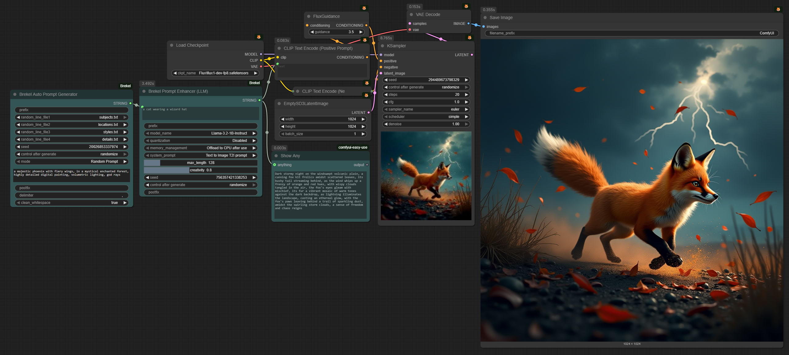
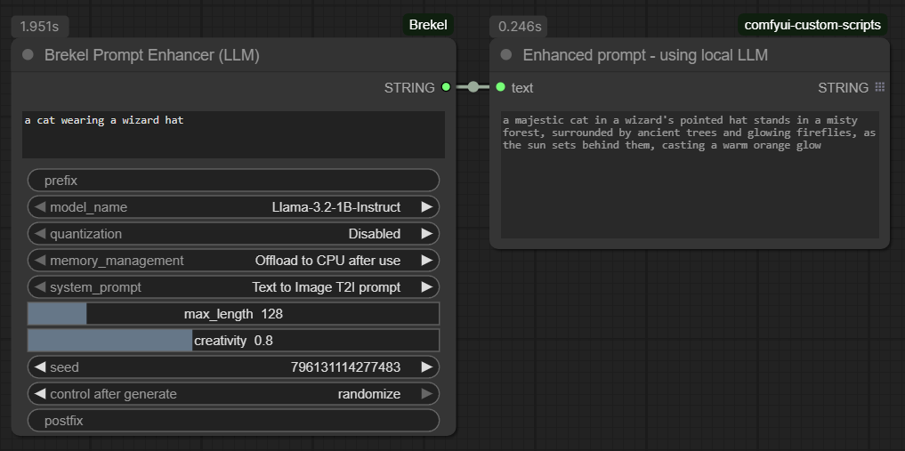
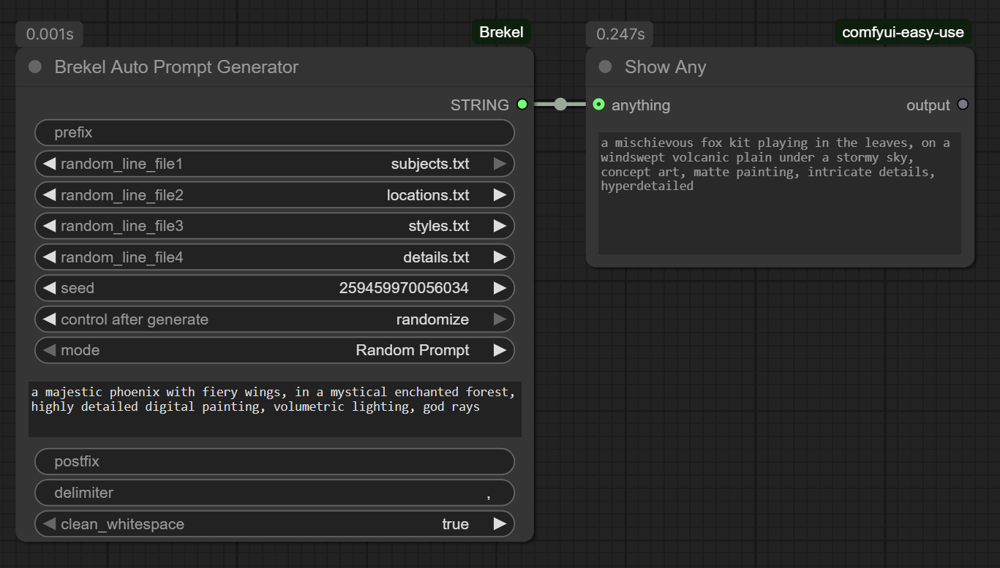

# Brekel's Custom Nodes for ComfyUI

A collection of custom nodes for ComfyUI designed to enhance and streamline your prompt engineering workflow.  
These nodes provide tools for generating, combining, enhancing, and selecting prompts dynamically. 




## Table of Contents

- [📦 Installation](#installation)
- [📖 Nodes Overview](#nodes-overview)
  - [📃 Brekel Prompt Enhancer (LLM)](#3-brekel-prompt-enhancer-llm)
  - [📃 Brekel Auto Prompt Generator](#2-brekel-auto-prompt-generator)
  - [📃 Brekel Prompt Chooser](#1-brekel-prompt-chooser)
- [📝 Author](#author)
## 


## 📦 Installation

#### Recommended: ComfyUI Manager

1. Open the **ComfyUI Manager**.
2. Click on **Install Custom Nodes**.
3. Search for `Brekel` or the name of one of the nodes.
4. Click **Install** on the desired node pack.
5. Restart ComfyUI. 

The manager will automatically handle the installation and download any required dependencies for the `Prompt Enhancer (LLM)` node.

#### 

#### Manual Installation (Git)

1. Navigate to your ComfyUI custom nodes directory:
   
   ```bash
   cd ComfyUI/custom_nodes/
   ```
2. Clone this repository:
   
   ```bash
   git clone https://github.com/brekel/ComfyUI-Brekel.git
   ```
3. Install the required Python packages for the `Prompt Enhancer (LLM)` node:
   
   ```bash
   cd ComfyUI-Brekel
   pip install -r requirements.txt
   ```
4. Restart ComfyUI.
## 


### 📃 Brekel Prompt Enhancer (LLM)

This node uses a local Large Language Model (LLM) to creatively rewrite and enhance a simple input prompt into a more detailed and descriptive one.  
No need for 3rd party apps or cloud API calls, all from within ComfyUI


#### Setup Requirements
**LLM Models**: This node uses LLM models from the `ComfyUI/models/LLM/` directory.  
The node expects models in the standard Hugging Face format (i.e., the folder should contain `config.json`, `model.safetensors`, etc.).

**Some LLM model suggestions**:
| Model name / link                                                                            | Model Size |
|:---------------------------------------------------------------------------------------------|:-----------|
| [Llama-3.2-1B-Instruct](https://huggingface.co/meta-llama/Llama-3.2-1B-Instruct)             | 1B         |
| [Llama-3.2-3B-Instruct](https://huggingface.co/meta-llama/Llama-3.2-3B-Instruct)             | 3B         |
| [Llama-3.1-8B-Uncensored](https://huggingface.co/Orenguteng/Llama-3.1-8B-Lexi-Uncensored-V2) | 8B         |
| [Qwen2-0.5B-Instruct](https://huggingface.co/Qwen/Qwen2-0.5B-Instruct)                       | 0.5B       |
| [Qwen2-1.5B-Instruct](https://huggingface.co/Qwen/Qwen2.5-1.5B-Instruct)                     | 1.5B       |

**To install a model**:
- Open a command prompt in the `ComfyUI/models/LLM/` directory.
- On the HuggingFace page click the three dots icon (just left to the Train button) and select `Clone Repository`.
- Copy the command that starts with: `git clone https://.......`
- Paste and execute this command in your command prompt.
- You may need to run the `git lfs install` first to install Large File Support.
- Some models (like Llama) may need you to request access first from the `Model card` page, approval make take while


**System Prompts**: The node reads "system prompts" (instructions for the LLM) from `.txt` files located in `ComfyUI/custom_nodes/ComfyUI-Brekel/prompt_enhancer/`.  
This folder is included with the installation and contains default system prompts for text-to-image and text-to-video. You can edit these or add your own `.txt` files to create custom LLM behaviors. (the node will automatically add a line to the prompt to ask the LLM to respect the `max_length`)

#### Inputs

| Parameter           | Type     | Description                                                                                                                                     |
|:------------------- |:-------- |:----------------------------------------------------------------------------------------------------------------------------------------------- |
| `prompt`            | STRING   | The simple, original prompt you want to enhance.                                                                                                |
| `prefix`            | STRING   | Prefix to prepend at the start of the prompt, for example to add your Lora trigger word(s).                                                     |
| `model_name`        | Dropdown | The LLM to use. The list is populated from your `ComfyUI/models/LLM/` folder.                                                                   |
| `quantization`      | Dropdown | VRAM saving technique. `16-bit` is highest quality, while `8-bit` and `4-bit` use significantly less VRAM at a slight cost to precision.        |
| `memory_management` | Dropdown | How to handle the model after use: `Keep in VRAM` (fastest for re-runs), `Offload to CPU` (saves VRAM), `Unload completely` (frees all memory). |
| `system_prompt`     | Dropdown | The instruction template for the LLM, loaded from the `prompt_enhancer` folder.                                                                 |
| `max_length`        | INT      | The maximum number of new tokens (words/characters) the LLM can generate.                                                                       |
| `creativity`        | FLOAT    | Controls the LLM's temperature. `0.0` is deterministic, while higher values (e.g., `0.8`) produce more creative and varied outputs.             |
| `seed`              | INT      | The seed for the LLM's random generation process. `0` means random.                                                                             |
| `postfix`           | STRING   | Postfix to append at the end of the prompt, for example to add your Lora trigger word(s).                                                       |
<br>


### 📃Brekel Auto Prompt Generator

This node constructs a complete prompt by combining up to four randomly selected lines from different text files with a optional prefix/postfix.
It's a powerful tool for creating complex, semi-randomized prompts while still allowing full control by customizing the text file contents.


#### How to Use

1. This node reads from `.txt` files located in the `ComfyUI/custom_nodes/ComfyUI-Brekel/auto_prompt_generator/` folder, which is included with the installation.
2. Populate this folder with your own `.txt` files or edit the existing examples. Each file should contain a list of items, one per line (e.g., a file for styles, another for artists, another for lighting types). You can of course add additional text files. (Refresn Node Definitions to update the node with new text file entries)
3. In ComfyUI, use the `random_line_file` dropdowns to select the files you want to draw from. Selecting "None" will skip that slot.
4. The node will pick one random line from each selected file and combine them with your `prefix` and `postfix` using the specified `delimiter`.
5. Alternatively, set `use_static_prompt` to "true" to bypass the random generation and use the text from the `static_prompt` input instead.

#### Inputs

| Parameter             | Type     | Description                                                                                                      |
|:--------------------- |:-------- |:---------------------------------------------------------------------------------------------------------------- |
| `prefix`              | STRING   | Text that will always appear at the beginning of the prompt.                                                     |
| `random_line_file1-4` | Dropdown | Select a `.txt` file from the `auto_prompt_generator` folder. The node will pick one random line from this file. |
| `seed`                | INT      | The seed used for choosing the random lines from the files.                                                      |
| `mode`                | Dropdown | `Random Prompt`: Selects random lines from the files. `Static Prompt`: Uses the `use_static_prompt`.             |
| `static_prompt`       | STRING   | A fixed prompt to use when `mode` is set to `Static Prompt`.                                                     |
| `postfix`             | STRING   | Text that will always appear at the end of the prompt.                                                           |
| `delimiter`           | STRING   | The character(s) used to join the different prompt parts (e.g., ", " or "\n" for a newline).                     |
| `clean_whitespace`    | Dropdown | `true`: Removes any leading/trailing whitespace from the final prompt.                                           |
<br>


### 📃 Brekel Prompt Chooser

This node allows you to select a text prompt from a folder of `.txt` files, either randomly or by a specific index.  
It's perfect for workflows where you want to iterate through a predefined list prompts.


#### How to Use

1. This node uses the `ComfyUI/custom_nodes/ComfyUI-Brekel/prompt_chooser/` folder, which is included with the installation.
2. Place your `.txt` files inside this folder. Each file should contain a single prompt.
   * Example: `cat.txt` could contain "A cat wearing a wizard hat".
   * Example: `dog.txt` could contain "A dog riding a skateboard".
   * Add as many of your own files and/or delete the example files as needed.
3. In ComfyUI, set the `folder_path` to this directory (it should be the default).
4. Choose your `selection_mode`:
   * **Random**: Uses the `seed` to pick a random file. A seed of 0 will be different each time.
   * **Index**: Picks a file based on its alphabetical order in the folder. The index will wrap around if it's larger than the number of files.

#### Inputs

| Parameter        | Type     | Description                                                                                                   |
|:---------------- |:-------- |:------------------------------------------------------------------------------------------------------------- |
| `folder_path`    | STRING   | The full path to the folder containing your `.txt` prompt files.                                              |
| `selection_mode` | Dropdown | `Random`: Selects a file randomly based on the seed. `Index`: Selects a specific file by its numerical index. |
| `seed`           | INT      | The seed for the random number generator when in `Random` mode.                                               |
| `file_index`     | INT      | The index of the file to choose (alphabetically sorted) when in `Index` mode.                                 |
<br>


## 📝 Author

These nodes were created by **Brekel**.
- **Website**: [https://brekel.com](https://brekel.com)